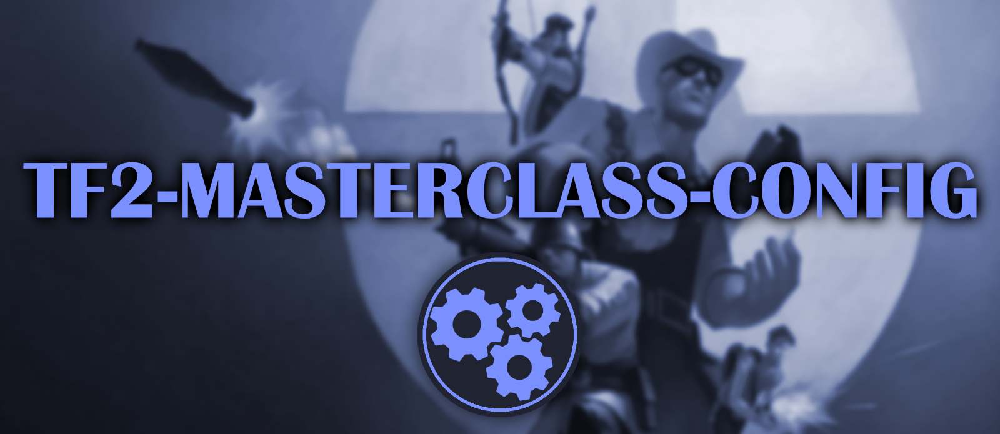

This project is a collection of advanced and customizable configuration scripts designed to enhance your gameplay experience in Team Fortress 2. These scripts leverage the wait function, which means they are compatible primarily with Valve servers. Most community servers disable the wait function with the setting `sv_allow_wait_command 0`, which limits the usage of these scripts. 

To check if a server allows the wait function, type `sv_allow_wait_command` in console while connected to said server. The console will output either, 1, which means wait function is allowed, or 0, which means it is disabled.

# Features
#### **Comprehensive Documentation**:
> Each `.cfg` file includes detailed comments explaining what each bind and command does.   
> A full list of keybinds can also be found here on GitHub, making it easy to find anything.

#### **Easy Installation**:
> Installation is made simple through the use of a python script that automates the whole process.  
> The installation process also includes the options to change a few common configuration options.
  
#### **Extensively Tested**:
> All configurations have been thoroughly tested to ensure stability and performance.   
> Please report any issues or errors by opening an issue here on GitHub.

# Keybinds
Check out all the default [Keybinds](https://github.com/7eventy7/TF2-MASTERCLASS-CONFIG/blob/main/KEYBINDS.md) that are avaliable in this config.

> It is a good idea to search through the keybinds before changing them during instaltion.     
> Failing to do can result in overwriting keybinds and causing many different issues

# Installation

## Windows 
1. Download and install [Python 3.0+](https://www.python.org/downloads/) for Windows.
2. Download the latest [release](https://github.com/7eventy7/TF2-MASTERCLASS-CONFIG/releases/latest) of `install-tf2-masterclass-config.py`.
3. Right Click `install-tf2-masterclass-config.py` > Open with > Python.
4. Follow the installation prompts and enjoy!

## Linux
1. Install Python 3.0+ using your package manager. For example, on Debian-based systems:
    ```bash
    sudo apt update
    sudo apt install python3
    ```
2. Download the latest [release](https://github.com/7eventy7/TF2-MASTERCLASS-CONFIG/releases/latest) of `install-tf2-masterclass-config.py`:
    ```bash
    wget https://github.com/7eventy7/TF2-MASTERCLASS-CONFIG/releases/latest/download/install-tf2-masterclass-config.py
    ```
3. Run the script using Python:
    ```bash
    python3 install-tf2-masterclass-config.py
    ```
4. Follow the installation prompts and enjoy!

## Mac
1. Install Python 3.0+ using Homebrew:
    ```bash
    /bin/bash -c "$(curl -fsSL https://raw.githubusercontent.com/Homebrew/install/HEAD/install.sh)"
    brew install python
    ```
2. Download the latest [release](https://github.com/7eventy7/TF2-MASTERCLASS-CONFIG/releases/latest) of `install-tf2-masterclass-config.py`:
    ```bash
    curl -LO https://github.com/7eventy7/TF2-MASTERCLASS-CONFIG/releases/latest/download/install-tf2-masterclass-config.py
    ```
3. Run the script using Python:
    ```bash
    python3 install-tf2-masterclass-config.py
    ```
4. Follow the installation prompts and enjoy!

> - You can alternatively perform a manual install using the latest "tf2-masterclass-config.zip"
> - I however will not be provide any support for this method

# Contributions / Support
If you encounter any issues, have questions, or have an improvement you'd like to share:
- please submit a pull request or open an issue on github.
